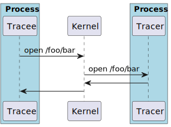
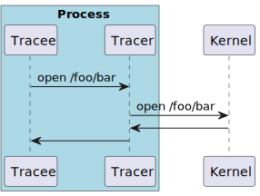

---
# pandoc --template=../acm-template.tex --filter=pandoc-crossref  --citeproc --biblatex -i README.md -o README.tex
# latexmk -interaction=nonstopmode -shell-escape -pdf -shell-escape -emulate-aux-dir -Werror README
# pdflatex -interaction=nonstopmode -shell-escape README
# biber README
from: markdown
verbosity: INFO
citeproc: yes
ccite-method: citeproc
bibliography:
  - ../zotero.bib
link-citations: yes
link-bibliography: yes
notes-after-punctuation: yes
title: Transparent, performant, non-privileged provenance tracing through library interposition
author:
  - name: Samuel Grayson
    orcid: 0000-0001-5411-356X
    email: grayson5@illinois.edu
    affiliation:
      institution: University of Illinois Urbana-Champaign
      department:
        - Dept. of Computer Science
      streetaddress: 201 North Goodwin Avenue MC 258
      city: Urbana
      state: IL
      country: USA
      postcode: 61801-2302
  - name: Shofiya Bootwala
    email: shofiyabootwala@gmail.com
    orcid: 0009-0004-1871-7357
    affiliation:
      institution: Gujarat Technological University
      # department:
      #   - 
      #streetaddress: 100 Street
      city: Ahmedabad
      state: Gujarat
      country: India
      postcode: 382424
  - name: Jenna Fligor
    #orcid: 0000-0001-5411-356X
    email: jenna@fligor.net
    affiliation:
      institution: University of Illinois Urbana-Champaign
      department:
        - Dept. of Computer Science
      streetaddress: 201 North Goodwin Avenue MC 258
      city: Urbana
      state: IL
      country: USA
      postcode: 61801-2302
  - name: Kyrillos Ishak
    orcid: 0009-0003-0627-1901
    email: kyrillos.said@stud.tu-darmstadt.de
    affiliation:
      institution:  Alexandria University
      #department:
      #  - Dept.
      #streetaddress: 100 Street
      city: Alexandria
      state: State
      country: Egypt
      #postcode: 1000-100
  - name: Saleha Muzammil
    #orcid: XXXX-XXXX-XXXX-XXXX
    #email: me@example.com
    affiliation:
      institution: National University of Computer and Emerging Sciences 
      #department:
      #  - Dept. of Computer Science
      streetaddress:  100 Street
      city: Lahore
      state: Punjab
      country: Pakistan
      #postcode: 61801-2302
  - name: Asif Zubayer Palak
    orcid: 0009-0007-9519-3317
    email: asif.zubayer.palak@g.bracu.ac.bd
    affiliation:
      institution: BRAC University
      #department:
      #  - Dept. of Computer Science
      #streetaddress:  100 Street
      city: Merul Badda
      state: Dhaka
      country: Bangladesh
      #postcode: 61801-2302
  - name: Reed Milewicz
    orcid: 0000-0002-1701-0008
    email: rmilewi@sandia.gov
    affiliation:
      department:
        - Software Eng. and Research Dept.
      institution: Sandia National Laboratories
      city: Albuquerque
      state: NM
      country: USA
      postcode: 87123
      streetaddress: 1515 Eubank Blvd SE
  - name: Daniel S. Katz
    orcid: 0000-0001-5934-7525
    email: d.katz@ieee.edu
    affiliation:
      institution: University of Illinois Urbana-Champaign
      department:
        - NCSA & CS & ECE & iSchool
      streetaddress:  1205 W Clark St
      city: Urbana
      state: IL
      country: USA
      postcode: 61801
  - name: Darko Marinov
    orcid: 0000-0001-5023-3492
    email: marinov@illinois.edu
    affiliation:
      institution: University of Illinois Urbana-Champaign
      department:
        - Dept. of Computer Science
      streetaddress: 201 North Goodwin Avenue MC 258
      city: Urbana
      state: IL
      country: USA
      postcode: 61801-2302
classoption:
  - sigconf
  - screen=true
  - review=false
  - authordraft=false
  - timestamp=false
  - balance=false
  - pbalance=true
papersize: letter
pagestyle: plain
lang: en-US
standalone: yes # setting to yes calls \maketitle
number-sections: yes
indent: no
date: 2024-12-15
pagestyle: plain
papersize: letter
abstract: >
  Provenance tracing is the idea of capturing the *provenance* of computational artifacts, (e.g., what version of the program wrote this file).
  Prior work proposes recompiling with instrumentation, ptrace, and kernel-based auditing, which at best achieves two out of three desirable properties: transparency, performance, and non-privilege.

  We present PROBE, a system-level provenance collector that uses library interpositioning to achieve all three.
  We evaluate the performance of PROBE for scientific users.
---
<!--
TODO: add shortauthor to template
-->
\renewcommand{\shortauthors}{Grayson et al.}
# Introduction

<!--
TODO: introduce new style for new terms
TODO: uniformly use "trace" instead of "track" and "collect"
-->

For computational artifacts, computational provenance (just **provenance** from here on) refers to the process which generated the artifact, the inputs to that process, and the provenance of those inputs.
This definition permits a graph representation where the artifacts and processes become nodes; an edge indicates that an artifact was generated by a process or that a process used some artifact (for example, @fig:example).

<!--
TODO:
- embed the graphviz in this file
- size text in the SVG without raw LaTeX
-->

\scriptsize

 {#fig:example width=40%}

\normalsize

Provenance can be **retrospective**, documenting processes that were run, or **prospective**, specifying what processes should be run.
Provenance can be collected at several different levels

<!-- TODO: write about service-level -->
1. **Application-level**: modify each application to emit provenace data.
   Application-level provenance is the most semantically rich but least general, as it only enables collection by that particular modified application [@freireProvenanceComputationalTasks2008].

2. **Language/workflow-level provenance**: modify the programming language or workflow language, and all programs written for that language would emit provenance data.
   Workflow engines are only aware of the dataflow, not higher-level semantics, so workflow-level provenance is not as semantically rich as application-level provenance.
   However, workflow-level is more general than application-level provenance, as it enables collection in any workflow written for that modified engine [@freireProvenanceComputationalTasks2008].

3. **System-level provenance**:, use operating system facilities to report the inputs and outputs that a process makes.
   System-level provenance is the least semantically aware because it does not even know dataflow, just a history of inputs and outputs, but it is the most general, because it supports any process (including any application or workflow engine) that uses watchable I/O operations [@freireProvenanceComputationalTasks2008].

This work focuses on system-level, retrospective provenance (SLRP).
SLRP tracing has a number of applications:

1. **Reproducibility**.
   SLRP collects a description of how to generate each artifact, so it could inform users what commands are necessary to reproduce their work.

2. **Caching subsequent re-executions**.
   Computational science often involves an iterative process of developing code, executing it, changing the code, and repeating.
   SLRP could inform the user what commands have to be re-run after minor changes to the code.
   Other solutions like Make require the user to manually specify a dependency graph, which is often unsound (not all dependencies are present).

3. **Comprehension**. 
   Provenance helps the user understand and document workflows and workflow results.
   An automated tool that consumes provenance can answer queries like "What version of the data did I use for this figure?" and "Does this workflow include FERPA-protected data?".

There are several design features of SLRP tracers:

1. **Transparency**:
   The user should not have to change their code to make it work in SLRP.

2. **Non-privilege**:
   A user should be able to use SLRP to trace their own processes without root-level access.
   Users of shared systems (e.g., HPC) would likely not have root access.
   Non-privilege may be relaxed to **user-level**:
   SLRP should be able to implemented at a user-level as opposed to kernel-level.
   Non-privilege implies user-level, but user-level does not imply non-privilege.

3. **Completeness**:
   The SLRP should trace as many sources of information from the host as possible, although there are some that may be too impractical to trace.

4. **Performance**:
   SLRP should have a minimal performance overhead from native execution.
   If the performance overhead is noticeable, users may selectively turn it off, resulting in provenance with gaps in the history.

We present PROBE, an SLRP that is a non-privileged SLRP tracer that is reasonably complete and performant.
We will explain how it works and document the limitations to completeness.
A complete performance analysis of PROBE and related prior work is left for future work.

The rest of the work proceeds as follows:

- @Sec:prior-work summarizes prior SLRP and related prior works
- @Sec:design documents the high-level design of PROBE.
- @Sec:implementation documents low-level implementation details of PROBE.
- @Sec:completeness-analysis quantifies the completeness of PROBE with respect to various information sources.
- @Sec:future-work outlines future work we would like to do on PROBE.
- @Sec:performance-analysis outlines how we intend to analyze the performance of PROBE and related work.

## Prior work {#sec:prior-work}

There have been several methods of collecting SLRP proposed in prior work:

<!-- TODO:
- List every prior work for each method
- Cite numbers for performance
- Check on that our claims on the other constraints are correct
-->

- **Virtual machines**: running the application in a virtual machine that tracks information flow.
  This method is extremely slow; e.g., PANORAMA has 20x overhead [@yinPanoramaCapturingSystemwide2007].

- **Recompiling with instrumentation**: recompile, where the compiler or libraries insert instructions that log provenance data, e.g., [@maMPIMultiplePerspective2017].
  This method is not transparent.

- **Static/dynamic binary instrumentation**: either before run-time (static) or while a binary is running (dynamic) change the binary to emit provenance data [@leeHighAccuracyAttack2017].
  This method requires special hardware (Intel CPU) and a proprietary tool (Intel PIN).

- **Kernel modification**: modify the kernel directly or load a kernel module that traces provenance information, e.g., [@pasquierPracticalWholesystemProvenance2017].
  This method is neither non-privileged nor user-level.

- **Use kernel auditing frameworks**: use auditing frameworks already built in to the kernel (e.g., Linux/eBPF, Linux/auditd, Windows/ETW).
  This method is not non-privileged.

- **User-level debug tracing**: use user-level debug tracing functionality provided by the OS (e.g, Linux/ptrace used by strace, CDE [@guoCDEUsingSystem2011], SciUnit [@phamUsingProvenanceRepeatability2013], Reprozip [@chirigatiReproZipComputationalReproducibility2016], RR [@ocallahanEngineeringRecordReplay2017]).

- **Library interposition**: replace a standard library with an instrumented library that emits provenance data as appropriate.
  This could use the `LD_PRELOAD` of Linux and `DYLD_INSERT_LIBRARIES` on MacOS.

If non-privilege, transparency, no special hardware, and performance overhead less than 10-times are hard-requirements, the only possible methods are user-level debug tracing and library interposition.

In user-level debug tracing, the tracer runs in a separate process than the tracee.
Every time the tracee does a system call, control switches from the tracee to the kernel to the tracer and back and back [@fig:ptrace].
This path incurs two context switches for every system call.

On the other hand, in library interposition, the tracer code is part of a library dynamically loaded into the tracee's memory space.
While this imposes restrictions on the tracer code, it eliminates the extra context switches [@fig:lib-interpose].

{#fig:ptrace width=40%}

{#fig:lib-interpose width=40%}

<!--
TODO:
Prior SLRP:
- PASS
- PASSv2
- CamFlow
- OPUS

Prior works that are substantially related to SLRP:
- RR
- strace
- fsatrace
- SciUnit
- ReproZip
- BubbleWrap
- Seccomp
- eBPF

Prior surveys/SoK
- Freire et al. Provenance for Computational Tasks: A Survey
- Oliveira et al. Provenance Analytics for Workflow-Based Computational Experiments: A Survey
- SoK by Inam et al. https://ieeexplore.ieee.org/stamp/stamp.jsp?arnumber=10179405
- Pimentel et al. A Survey on Collecting, Managing, and Analyzing Provenance from Scripts
- our prior 2024 ACM REP work

Matrix:
- Each row is a group of prior works
- Each column is an SLRP collector-feature
-->

# Concepts {#sec:design}

The user supplies a **command**, such as `python script.py -n 42`, to PROBE.

PROBE runs command with certain environment variables set, resulting in a **process**.

The process may create **child processes** that will also get traced by PROBE.

If a process calls a syscall from the `exec`-family, a new process is created with the same PID. We call the pair of (PID, "number of times `exec` has been called"), an **exec epoch**. Each process has at least one exec epoch.

Each process can spawn kernel-level **threads** that provide concurrent control-flow in the same address-space identified by the triple (PID, exec epoch, TID).

Threads do **operations**, like "open `file.txt` for reading" or "spawn a new process", identified by (PID, exec epoch, TID, operation number), where operation number increments for every operation the thread does.

A **dynamic trace** of a command is an tuple of:

- a PID which is the root
- a mapping of processes to an ordered list of exec epochs
- a mapping of exec epochs to threads
- a mapping of threads to a list of operations

Dynamic traces are what PROBE actually records.

**Program order** is a partial order on operations where $A$ precedes $B$ in program order if $A$ and $B$ are in the same thread and $A$'s operation number is less than $B$'s.

**Synchronization order** is a partial order on operations where $A$ precedes $B$ in program order for specific special cases based on the semantics of the operation.
PROBE currently tracks the following cases:

- $A$ is an exec and $B$ is the first operation of the next exec epoch for that process
- $A$ is a process-spawn or thread-spawn and $B$ is the first operation in the new process or thread.
- $A$ is a process-join or thread-join and $B$ is the last operation in the joined process (any thread of that process) or joined thread.

But the model is easily extensible other kinds of synchronization including shared memory locks, semaphores, and file-locks.

**Happens-before order**, denoted $\leq$, is a partial order that is the transitive closure of the union of program order and synchronization order.

We define a **dataflow** as a directed acyclic graph whose nodes are operations or versioned files.
The edges are the union of happens-before edges and the following:

- If operation $A$ opens a file at a particular version $B$ for reading, $A \to B$.
- If operation $A$ closes a file at a particular version $B$ which was previously open for writing, $A \to B$.

Tracking the _versioned files_ instead of files guarantees non-circularity.

Rather than track every individual file operation, we will only track file opens and closes.
If processes concurrently read and write a file, the result is non-deterministic.
Most working programs avoid this kind of race.
If a program does have this race, the dataflow graph will still be sound, but it may be _imprecise_, that is, it will not have all of the edges that it could have had if PROBE tracked fine-grain file reads and writes.

A **file** is an inode.
Defining a file this way solves the problem of _aliasing_ in filesystems.
If we defined a file as a path, we would be fooled by symlinks or hardlinks.
When we observe file operations, it is little extra work to also observe the inodes corresponding to those file operations.

<!--
TODO: discuss between-process-tree and within-process-tree provenance
-->

In practice, we use the pair modification times and file size as the version.
Modification time can be manipulated by the user, either setting to the current time with `touch` (very common) or resetting to an arbitrary time with `utimes` (very uncommon).
Setting to the current time creates a new version which does not threaten the soundness of PROBE.
Setting to an arbitrary time and choosing a time already observed by PROBE does threaten its soundness.
For this reason, we consider the file size as a "backup distinguishing feature".
We consider it very unlikely that a non-malicious user would accidentally reset the time to the exact time (nanosecond resolution) we already observed and have the exact same size.

# Implementation {#sec:implementation}

The core of PROBE is a library interposer for libc, called `libprobe.so`.
`libprobe.so` exports wrappers for I/O functions like `open(...)`.
The wrappers:

1. log the call with arguments
2. forward the call to the _true_ libc implementation
3. log the underlying libc's returned value
4. return the underlying libc's returned value

There is no data shared between threads as the log is thread-local.
The dynamic-trace consists of information that was collected at a thread-local level, but can be aggregated into a global-level dataflow graph as described in @Sec:design.

To make logging as fast as possible, the log is a memory-mapped file.
If the logged data exceeds the free-space left in the file, `libprobe.so` will allocate a new file big enough for the allocation.
After the process dies, these log files can be stitched together into a single dynamic trace.

PROBE has a command-line interface. The `record` subcommand:

1. sets `LD_PRELOAD` to load `libprobe.so`
2. runs the user's provided command
3. stitches the PROBE data files into a single, readable log for other programs

There are also several subcommands that analyze or export the provenance.
Those subcommands generally use the dataflow representation rather than the PROBE dynamic trace.

<!-- TODO: discuss persistent prov -->

<!-- TODO: discuss applications -->

# Completeness analysis  {#sec:completeness-analysis}

We read the GNU C Library manual^[<https://www.gnu.org/software/libc/manual/html_node/>] and wrapped every function that appeared to do file I/O in the following chapters, with the exception of redundant functions:

- Chapter 12. Input/Output on Streams
- Chapter 13. Low-Level Input/Output
- Chapter 14. File System Interface
- Chapter 15. Pipes and FIFOs
- Chapter 16. Sockets
- Chapter 26. Processes

One function, A, is redundant to another one B, if I/O through A necessitates a call through B.
We need only wrap B to discover that I/O will occur.
For example, we need only log file openings and closings, not individual file reads and writes.

So far, we wrapped:

- file `open` and `close` familiy of functions (64-bit variants, `f*` variants, re-open, close-range, etc.)
- changing directories (so we can determine how paths are resolved)
- directory opens, closes, and iterations families
- file `stat` and `access` families of functions
- file `chown`, `chmod`, and `utime` families of functions
- `exec` family of functions
- `fork`, `clone`, `wait` families of functions
- `pthread_create`, `pthread_join`, `thrd_create`, `thrd_join`, etc. functions

<!--
- Compare theoretically and empirically with others
  - Library interposition trades off in completeness slightly.
    - We can detect and caution the user when they are tracing an application for which PROBE provenance collection may be incomplete
- Collecting provenance by itself is not the end goal; can PROBE provenance do some of the motivating applications mentioned above?

- **RQ:** How does the provenance output of PROBE compare with prior provenance tracers (case studies)? Is it more complete or detailed?
  - Consider system-level provenance tracers separately from workflow-level and language-level provenance tracers
  - Cases: pile-of-scripts, standalone workflow, embedded workflow, C application, Python application, Jupyter Notebook
- **RQ:** How faithfully can heuristics create a runnable package specification from a prov description?
-->

<!-- # Threats to validity -->

<!-- # Conclusion -->

# Future work {#sec:future-work}

- Improve completeness: static binary rewriting
- Improve performance
- Multi-node and HPC cases

## Performance analysis {#sec:performance-analysis}

We intend to do a performance analysis by studying commonly used scientific applications.
We will sample popular projects from several repositories and run them in PROBE including:

- Spack packages, filtering for packages that contain an executable, and using each package's project's GitHub repo's stars as a measure of popularity
- Kaggle notebooks, using the number of stars as popularity
- WorkflowHub, using the number of citations of the associated DOI as a measure of popularity

<!--
- Hinsen's stack:
  - Project-specific code
  - Tutorials for scientific infrastructure are hypothetical to project-specific codes
  - Benchmarks of scientific infrastructure intended to mimic patterns of project-specific code

Scientific applications:

- Non-HPC-scale numerical applications
  - Sample from: WorkflowHub, Snakemake Worklow Catalog, Nf-core, UseGalaxy.eu, xSDK packages
  - Comp chem
  - Comp bio info
  - Comp phys
  - Comp astro
  - Earth science
  - Machine learning (non GPU side, data cleaning)
  - Generic data analysis
  - Lots of benchmarks here
- Client/server programs
  - Jupyter notebooks
    - Sample popular Kaggle notebooks
- Package management
  - Spack
  - Conda
  - Pip
- Benchmarks from ACM REP prior work

Big matrix

- **RQ1:** What is the overhead of PROBE compared to prior work on scientific benchmarks?
  - Root-level system-provenance tracers, Workflow-level provenance tracers
-->
